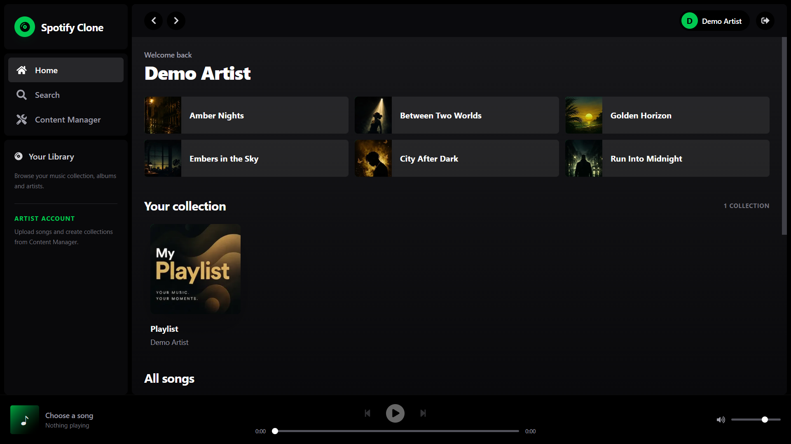
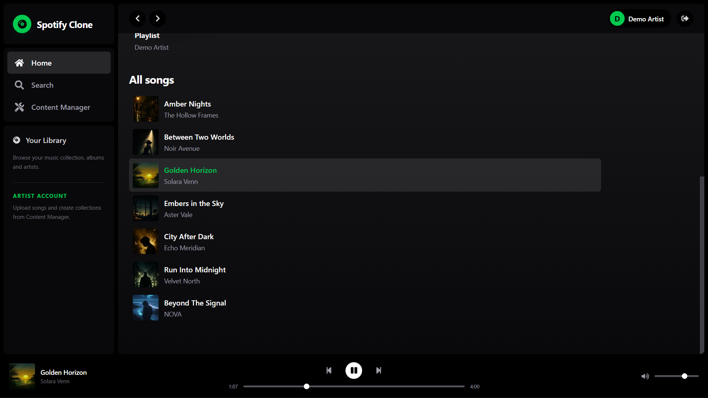
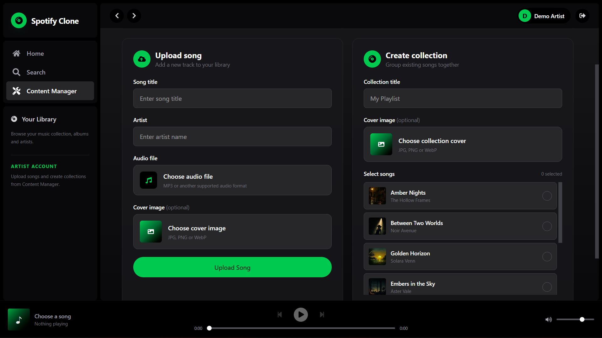
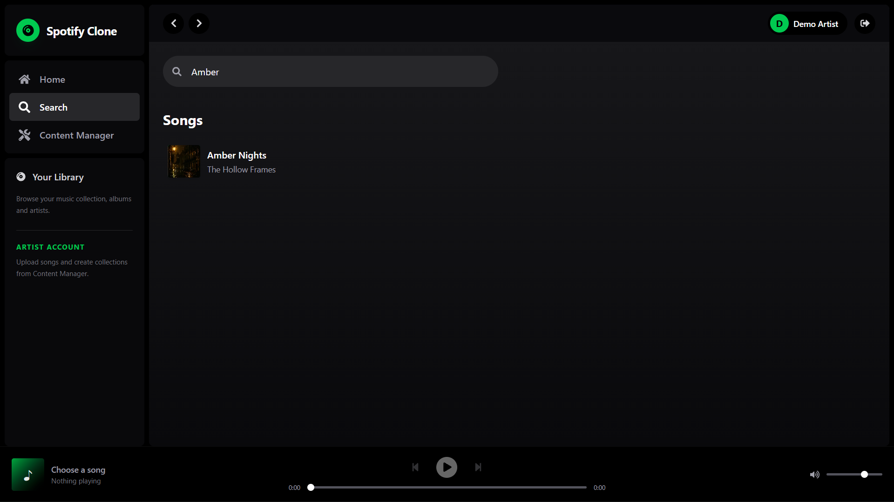

# 🎵 Spotify Clone

A full-stack Spotify-inspired music streaming web application built using the MERN stack.

The application allows users to browse music, search for songs, play audio using a persistent music player, explore collections, and manage music through a dedicated Content Manager.

> **Note:** This project was created for educational and portfolio purposes. It is inspired by Spotify but is not affiliated with, endorsed by, or connected to Spotify.

---

## 📸 Preview

### Home



### Music Library & Player



### Content Manager



### Search



---

## ✨ Features

- 🎵 Stream and play songs directly in the browser
- ⏯️ Play and pause music
- ⏭️ Navigate between tracks
- 🔊 Volume control
- ⏱️ Interactive playback progress bar
- 🖼️ Song cover artwork
- 🔍 Search songs by title or artist
- 💿 Create and browse music collections
- 📂 View songs inside collections
- ⬆️ Upload songs through the Content Manager
- 🖼️ Upload custom song and collection artwork
- 🎧 Persistent music player across application pages
- 🔐 User authentication
- 👤 User-specific interface
- 📱 Responsive Spotify-inspired dark UI
- ⚡ Dynamic frontend connected to a REST API
- ❤️ Like and unlike songs
- 💚 View all favourite songs in a dedicated Liked Songs page

---

## 🛠️ Tech Stack

### Frontend

- React
- Vite
- JavaScript
- CSS
- React Router
- Axios

### Backend

- Node.js
- Express.js
- MongoDB
- Mongoose
- JWT Authentication
- Multer

---

## 🧩 Application Pages

### 🏠 Home

The home page displays available songs and music collections while providing quick access to playback.

### 🔎 Search

Users can search the music library using song titles or artist names.

### 🎛️ Content Manager

The Content Manager provides an interface for managing music without requiring external API tools.

Users can:

- Upload an audio file
- Add song title and artist information
- Upload cover artwork
- Create music collections
- Select existing songs for a collection
- Upload collection artwork

### 💿 Collections

Collections group multiple songs together and provide a dedicated view for browsing and playing their tracks.

### 🎧 Music Player

The persistent bottom player provides:

- Play / pause controls
- Previous / next track controls
- Playback progress
- Current playback time
- Track duration
- Volume control
- Current song information and artwork

---

## 📁 Project Structure

```text
SPOTIFY_CLONE/
│
├── backend/
│   ├── src/
│   │   ├── controllers/
│   │   ├── models/
│   │   ├── routes/
│   │   ├── middleware/
│   │   └── ...
│   │
│   ├── package.json
│   └── .env
│
├── frontend/
│   ├── src/
│   │   ├── components/
│   │   ├── pages/
│   │   └── ...
│   │
│   └── package.json
│
├── screenshots/
│   ├── home.png
│   ├── songs.png
│   ├── content-manager.png
│   └── search.png
│
├── .gitignore
└── README.md
```

---

## 🚀 Getting Started

### Prerequisites

Make sure you have installed:

- Node.js
- npm
- MongoDB

---

### 1. Clone the repository

```bash
git clone <your-repository-url>
cd SPOTIFY_CLONE
```

---

### 2. Install backend dependencies

```bash
cd backend
npm install
```

---

### 3. Install frontend dependencies

Open another terminal:

```bash
cd frontend
npm install
```

---

### 4. Configure environment variables

Create a `.env` file inside the backend directory.

Example:

```env
PORT=3000
MONGODB_URI=your_mongodb_connection_string
JWT_SECRET=your_jwt_secret
```

Add any other environment variables required by your backend configuration.

> Never commit your real `.env` file or credentials to GitHub.

---

### 5. Start the backend

From the backend directory:

```bash
npm run dev
```

If your backend does not use a `dev` script, use the start command defined in `backend/package.json`.

---

### 6. Start the frontend

From the frontend directory:

```bash
npm run dev
```

Vite will display the local development URL in the terminal.

Open it in your browser to use the application.

---

## 🎶 Adding Music

Songs can be added directly through the application's **Content Manager**.

Provide:

1. Song title
2. Artist name
3. Audio file
4. Cover image (optional)

After uploading, the song becomes available to the application and can also be added to collections.

---

## 🔒 Environment Variables & Security

Sensitive configuration is intentionally excluded from the repository through `.gitignore`.

The project ignores files such as:

```text
.env
.env.*
node_modules/
dist/
build/
*.log
```

An `.env.example` file can be committed to demonstrate the required environment variable names without exposing actual credentials.

---

## ⚠️ Media Disclaimer

This repository is intended for educational and portfolio purposes.

The repository should not contain copyrighted commercial music files or other media that the repository owner does not have permission to redistribute.

Demo song titles, artist names, and artwork shown in the project screenshots may use fictional/demo data for presentation purposes.

---

## 🎯 Project Goals

This project was built to practice full-stack web development concepts including:

- Building REST APIs with Express
- MongoDB database integration
- React frontend development
- Authentication and authorization
- File uploads
- Audio playback in the browser
- Global player state management
- Search functionality
- Connecting frontend and backend applications
- Building reusable UI components

---

## 🔮 Possible Future Improvements

Potential features that could be added in the future include:

- Playlists for individual users
- Recently played songs
- Queue management
- Shuffle and repeat controls
- Artist profile pages
- Improved mobile responsiveness
- Music recommendations
- Cloud-based media storage

---

## 👨‍💻 Author

Built as a full-stack web development project.

---

## 📄 License

This project is intended for educational and portfolio use.